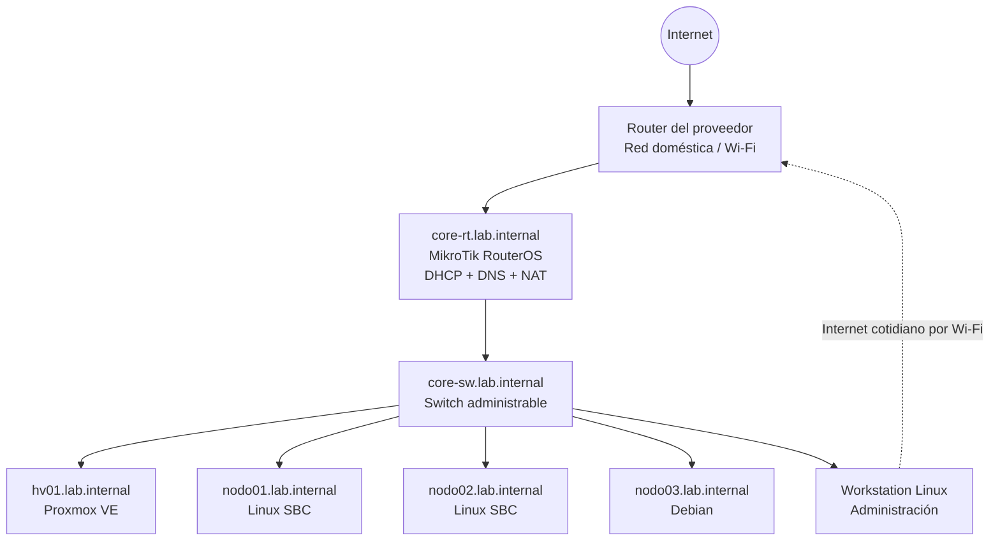

# VPHUB Homelab: infraestructura, redes y virtualización desde cero

> Proyecto personal de laboratorio para practicar administración de infraestructura IT de manera ordenada, documentada y segura.

## Por qué hice este proyecto

Quería dejar de practicar con equipos aislados y construir una pequeña infraestructura que se pareciera a un entorno real: un router que controle la red del laboratorio, un switch central, un hypervisor para desplegar servicios y varios nodos Linux administrados de forma consistente.

El desafío no era solamente “hacer que funcione”. El objetivo fue **ordenar la red, documentar decisiones, separar accesos, validar conectividad y preparar una base mantenible** para seguir aprendiendo.

## Qué construí

Diseñé una red de laboratorio independiente de la red doméstica principal:

- **MikroTik RouterOS** como router del homelab, DHCP, DNS interno y NAT.
- **Switch administrable** como punto central de conexión física.
- **Proxmox VE** como plataforma de virtualización.
- **Nodos Linux** para prácticas futuras y pruebas de servicios.
- **Administración SSH con llave dedicada**, separada de mis credenciales de Git.
- **Documentación y backups** antes de comenzar a desplegar servicios.

> Los datos publicados en este repositorio están sanitizados: las direcciones, identificadores y ejemplos no representan credenciales ni inventario operativo real.

## Arquitectura lógica



## Habilidades puestas en práctica

| Área | Trabajo realizado |
|---|---|
| Networking | Diseño de subred privada, gateway, topología física y salida controlada |
| MikroTik / RouterOS | DHCP, DNS estático interno, NAT, documentación de interfaces y acceso SSH |
| Switching | Identificación de puertos mediante tabla MAC y documentación de cableado |
| Linux | Usuarios administrativos, `sudo`, hostname/FQDN, rutas y validaciones |
| SSH | Llave Ed25519 exclusiva para el laboratorio y configuración por host |
| Proxmox VE | Normalización de red de administración, acceso web/SSH y preparación para VMs |
| Troubleshooting | Validación paso a paso: ICMP, rutas, DNS, HTTPS, servicios y persistencia |
| Operación IT | Backups previos/posteriores, bitácora y documentación reutilizable |

## Decisiones técnicas

### 1. Separar el laboratorio de la red doméstica

Mantuve la red del hogar operativa mientras incorporaba una subred independiente para VPHUB. Esto permitió trabajar sin interrumpir conectividad de uso diario y, a la vez, tener un entorno controlado para prácticas.

### 2. Usar una llave SSH exclusiva

No reutilicé la llave utilizada para repositorios Git. Creé una llave dedicada al homelab y la instalé solo en los equipos administrados.

### 3. Documentar antes de crecer

Antes de crear máquinas virtuales o servicios, relevé:

- nombres e IPs;
- roles de los dispositivos;
- conexiones físicas;
- rutas y DNS;
- accesos administrativos;
- estrategia inicial de backups.

### 4. No instalar servicios directamente en el hypervisor

El host Proxmox queda reservado para virtualización. Los servicios futuros se desplegarán en VMs o contenedores para mantener orden, aislamiento y capacidad de recuperación.

## Resultado alcanzado

- Todos los equipos del laboratorio resuelven nombres internos.
- Los nodos Linux y el router son administrables mediante SSH con llave.
- El hypervisor está listo para desplegar servicios.
- La red del laboratorio tiene salida a Internet controlada por el router.
- La topología quedó identificada y documentada.
- La base es reproducible y puede ampliarse con monitoreo, servicios y segmentación.

## Estructura del repositorio

```text
vphub-homelab/
├── README.md
├── docs/
│   ├── 01-arquitectura-y-decisiones.md
│   ├── 02-red-dns-y-conectividad.md
│   ├── 03-acceso-ssh-y-administracion.md
│   ├── 04-proxmox-y-virtualizacion.md
│   ├── 05-troubleshooting-y-validaciones.md
│   ├── 06-backups-seguridad-y-roadmap.md
│   └── 07-aprendizajes-y-presentacion.md
├── diagrams/
│   └── topologia-logica.mmd
├── examples/
│   ├── ssh_config.example
│   ├── routeros-dns-nat.example.rsc
│   └── inventario.example.md
├── scripts/
│   └── validar-lab.example.sh
└── .gitignore
```

## Próximos pasos

- Crear una VM Debian base en Proxmox.
- Incorporar monitoreo de disponibilidad y uso de recursos.
- Diseñar backups de VMs y pruebas de restauración.
- Evaluar VLANs para administración, servicios y laboratorio.
- Reemplazar gradualmente la dependencia del router doméstico por una arquitectura con APs dedicados.

## Nota de seguridad

Este repositorio es una versión pública y didáctica del proyecto. No contiene:

- llaves privadas;
- contraseñas;
- backups reales;
- MAC addresses reales;
- fingerprints SSH reales;
- configuración exportada de equipos en producción.
