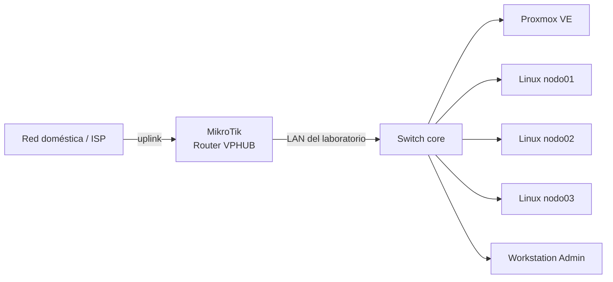

# 01 - Arquitectura y decisiones de diseño

## Contexto

VPHUB nació como un proyecto personal para consolidar prácticas de redes, Linux y virtualización en un entorno propio. La idea fue pasar de pruebas sueltas a una infraestructura pequeña pero administrada con criterios de operación reales.

## Requisitos que me propuse

| Requisito | Criterio |
|---|---|
| No interrumpir la red doméstica | El laboratorio debía convivir con el acceso Wi-Fi habitual |
| Tener una red controlada | DHCP, DNS y gateway propios del laboratorio |
| Centralizar virtualización | Un host Proxmox como base para futuros servicios |
| Administrar de forma segura | SSH con llave dedicada y usuarios nominales |
| Poder reconstruir lo hecho | Documentación, validaciones y backups |

## Diseño elegido

El laboratorio queda detrás de un router MikroTik. El router del proveedor conserva temporalmente la conectividad del hogar y entrega un uplink al router del lab.

## Por qué no migré todo de una sola vez

En una infraestructura real, los cambios deben minimizar impacto. La decisión fue mantener la red doméstica funcionando mientras construía y validaba el laboratorio por etapas:

1. Crear red interna y direccionamiento.
2. Verificar administración y accesos.
3. Configurar DNS interno.
4. Validar salida a Internet.
5. Documentar cableado y respaldos.
6. Recién entonces empezar a crear servicios.

## Componentes y responsabilidades

| Componente | Rol en la arquitectura |
|---|---|
| Router del proveedor | Conectividad doméstica temporal y uplink al lab |
| MikroTik RouterOS | Gateway, DHCP, DNS interno y NAT del laboratorio |
| Switch administrable | Concentración física y visibilidad de enlaces |
| Proxmox VE | Virtualización para servicios futuros |
| Nodos Linux | Prácticas, agentes, automatización o servicios ligeros |
| Workstation Linux | Administración y documentación |

## Principios aplicados

- Separación de responsabilidades.
- Cambios pequeños con verificación posterior.
- No usar cuentas o llaves genéricas cuando se puede identificar al administrador.
- No desplegar servicios sobre el hypervisor base.
- No publicar inventario sensible real.
