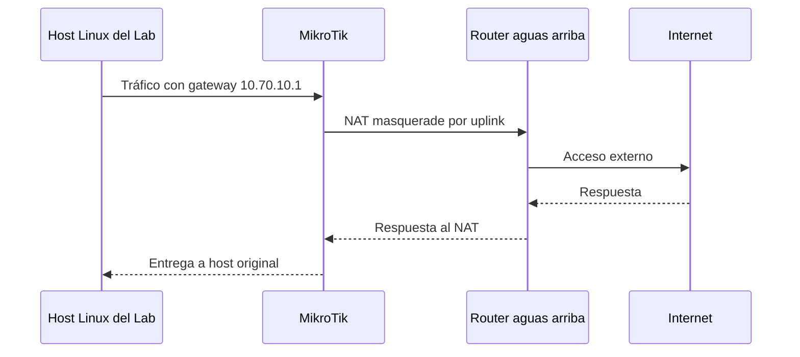

# 02 - Red, DNS y conectividad

## Direccionamiento público de ejemplo

Para la versión pública se utiliza un esquema sanitizado:

| Equipo | Función | Dirección de ejemplo |
|---|---|---:|
| `core-rt.lab.internal` | Router de laboratorio | `10.70.10.1/24` |
| `core-sw.lab.internal` | Switch core | `10.70.10.2/24` |
| `hv01.lab.internal` | Proxmox | `10.70.10.10/24` |
| `nodo01.lab.internal` | Linux node | `10.70.10.20/24` |
| `nodo02.lab.internal` | Linux node | `10.70.10.21/24` |
| `nodo03.lab.internal` | Linux node | `10.70.10.22/24` |
| `admin-ws` | Estación administrativa | `10.70.10.200/24` |

La conexión aguas arriba se representa con la red de documentación `192.0.2.0/24`, no con una red real.

## Servicios del router de laboratorio

| Servicio | Función |
|---|---|
| DHCP | Entregar IP, gateway, DNS y dominio de búsqueda a clientes del lab |
| DNS cache / estático | Resolver nombres internos y reenviar consultas externas |
| NAT masquerade | Permitir salida de la LAN hacia el uplink |
| SSH | Administración remota autenticada por llave |

## DNS interno

Los equipos del laboratorio se acceden por nombre, no por memorizar direcciones IP:

```text
core-rt.lab.internal
core-sw.lab.internal
hv01.lab.internal
nodo01.lab.internal
nodo02.lab.internal
nodo03.lab.internal
```

Ejemplo conceptual de registros:

| Nombre | IP |
|---|---:|
| `core-rt.lab.internal` | `10.70.10.1` |
| `core-sw.lab.internal` | `10.70.10.2` |
| `hv01.lab.internal` | `10.70.10.10` |
| `nodo01.lab.internal` | `10.70.10.20` |
| `nodo02.lab.internal` | `10.70.10.21` |
| `nodo03.lab.internal` | `10.70.10.22` |

## Separación entre administración e Internet cotidiano

La workstation puede mantener dos interfaces:

| Interfaz | Uso |
|---|---|
| Wi-Fi | Navegación habitual por la red doméstica |
| Ethernet | Administración directa del laboratorio |

Verificación conceptual en Linux:

```bash
ip route get 1.1.1.1
ip route get 10.70.10.10
```

Resultado buscado:

```text
Internet → interfaz Wi-Fi / gateway doméstico
Lab      → interfaz Ethernet / red local del homelab
```

## Flujo de salida a Internet



## Validaciones realizadas

| Prueba | Qué confirma |
|---|---|
| `ping gateway` | Conectividad de capa 3 hacia el router |
| `ping 1.1.1.1` | Salida IP sin depender de DNS |
| `getent hosts debian.org` | Resolución DNS |
| `curl -I https://deb.debian.org` | Salida HTTPS funcional |
| `ssh host.lab.internal` | DNS interno más administración segura |
